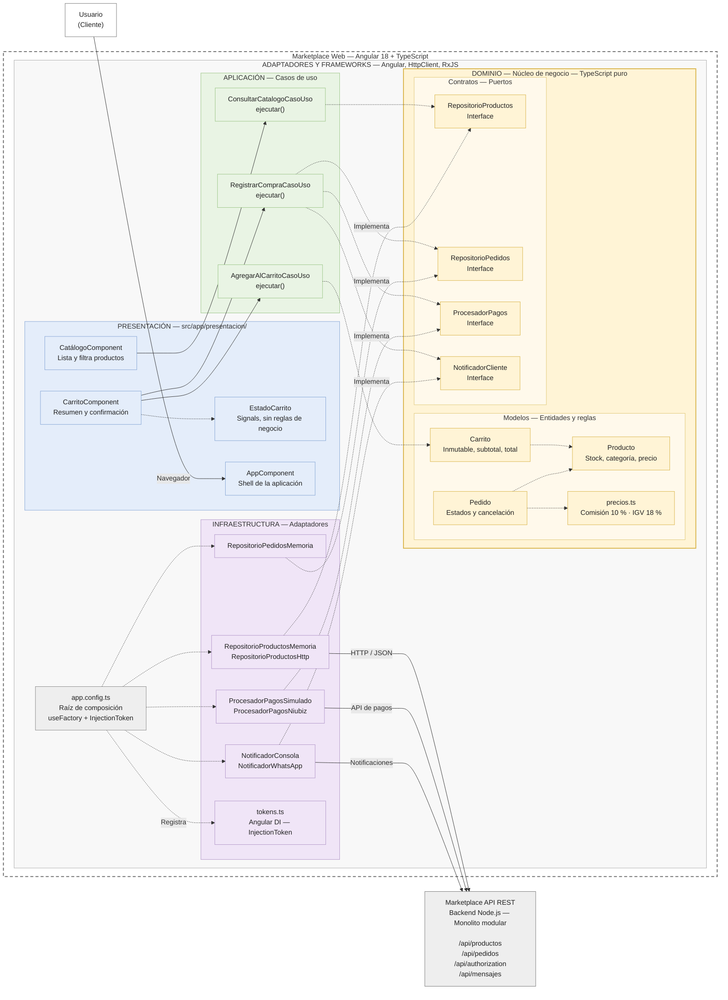

## Enfoque Arquitectónico

| Elemento | Descripción aplicada al Marketplace |
| --- | --- |
| Patrón / enfoque arquitectónico | Clean Architecture (Arquitectura Limpia). |
| Objetivo | Separar responsabilidades y controlar las dependencias hacia el dominio.|
| ¿Qué problema resuelve?| Evita el acoplamiento entre la interfaz Angular, las reglas del negocio y las tecnologías externas, como bases de datos, API y servicios de pago.|
| Capas definidas | Presentación, Aplicación, Dominio e Infraestructura. |
| Beneficios| • Facilita el mantenimiento y las pruebas unitarias. • Permite cambiar implementaciones técnicas sin modificar innecesariamente las reglas del negocio. • Mejora la organización y separación de responsabilidades del código.|

### Diagrama de arquitectura

